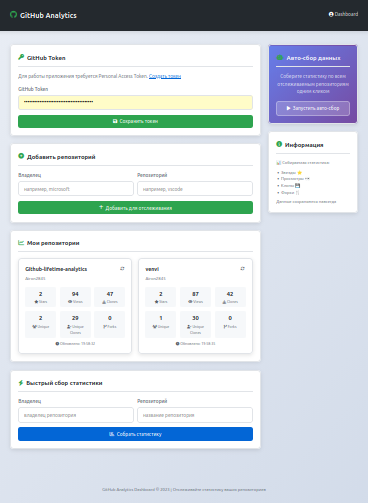

# 🚀 GitHub Analytics Dashboard V1.1

**Professional dashboard for monitoring GitHub repository analytics**

**Профессиональная панель мониторинга для анализа статистики GitHub репозиториев**

## 📊 What is this project? / О чем этот проект?

GitHub Analytics Dashboard is a powerful tool for **continuous tracking of your GitHub repository metrics**. Unlike standard GitHub statistics that store data for only 14 days, our application **saves all history forever**!

GitHub Analytics Dashboard — это мощный инструмент для **постоянного отслеживания метрик** ваших GitHub репозиториев. В отличие от стандартной статистики GitHub, которая хранит данные всего 14 дней, наше приложение **сохраняет всю историю навсегда**!

### 🎯 Key Features / Ключевые возможности

| Feature / Функция | Advantage / Преимущество |
|------------------|--------------------------|
| 📈 **Historical Data** **Исторические данные** | Saves statistics forever, not just 14 days Сохраняет статистику навсегда, а не 14 дней |
| 🎨 **Beautiful Widgets** **Красивые виджеты** | Intuitive cards with live statistics Интуитивные карточки с живой статистикой |
| 🤖 **Auto Collection** **Автоматический сбор** | Data updates automatically Данные обновляются автоматически |
| 📱 **Responsive Design** **Адаптивный дизайн** | Works on any device Работает на любом устройстве |
| 🔐 **Secure Storage** **Безопасное хранение** | Tokens protected, data isolated Токены защищены, данные изолированы |

### Main Interface Sections / Основные разделы интерфейса:

1. **🔑 Token Panel** / **Панель токена** - Secure GitHub Personal Access Token storage
2. **➕ Add Repositories** / **Добавление репозиториев** - Just specify owner and repository name
3. **📊 Stats Widgets** / **Виджеты статистики** - Beautiful cards with live data for each repository
4. **⚡ Quick Collect** / **Быстрый сбор** - Instant statistics collection for any repository
5. **🤖 Auto Collect** / **Авто-сбор** - Bulk update all tracked repositories
